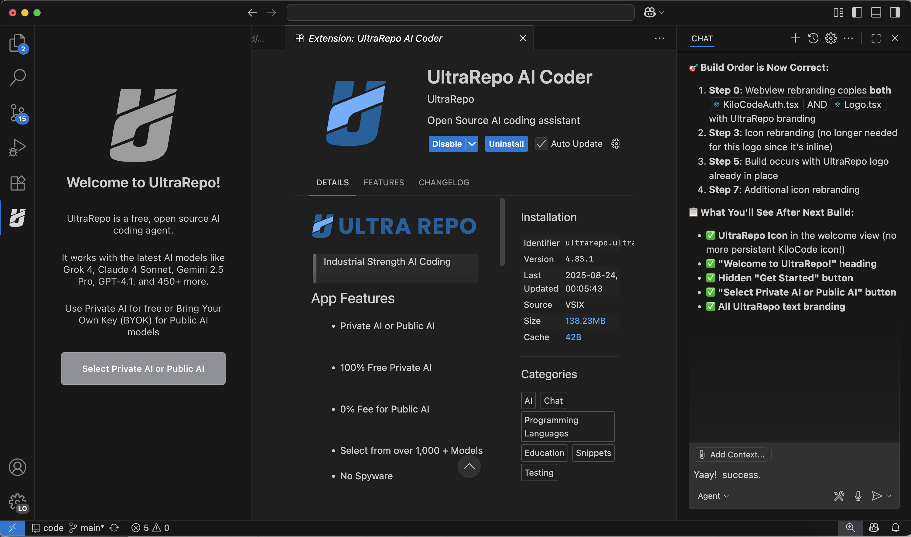

# AirVeo Builder VS Code Extension

<div align="center">
  
</div>

AirVeo Builder is a free AI coding tool that allows you to use **local AI services** at no charge, or your own remote AI services accounts from OpenRouter, xAI, Google, OpenAI, Anthropic and more. We're building in a set of repository tools that will extend the range of AI LLMs to well beyond the typical 1MB context window.

## Developer Quickstart

## Problem and Solution Vision

**Problem:** Nearly all IDEs utilize remote, cloud based AI services.  While remote services can be very useful for persistence across projects and as a team resource, often we desire the privacy, control, performance and financial freedoms that only a private AI infrastructure can provide. One huge problem: AI IDEs have poor memory, and a context window of 1MB is completely inadequate for most professional dev projects.

**Solution:** AirVeo Builder for VS Code is designed to provide developers with local control over all elements of their dev environment. With a set of advanced coding tools, MCP Hub services and more, AirVeo Builder extends the capability, reliability, accuracy and context window of typical AI IDEs. By default, AirVeo Builder provides a platform that uses **local AI** via LMstudio or Docker AI Services (100% OpenAI Compatible) on your local machine. You can use **remote AI** cloud services if you want -- just add your api key and AI services info (stored in VS Code Secrets).

## Overview of Rebranding and Building Scripts

This document describes the complete process for transforming the KiloCode/UltraRepo VS Code extension into the AirVeo Builder-branded extension with refactored commands and custom branding.

## Project structure (developer view)

```
/Users/jetstart/dev/airveo-builder/
├── upstream/kilocode/                # Original KiloCode source (read-only/submodule)
├── build/kilocode/                   # Working build copy created by rebrand scripts (generated)
├── rebrand/                          # Rebrand source files, patches, and scripts (edit here)
│   ├── assets/icons/                 # AirVeo Builder icon assets used during rebrand
│   ├── webview-ui/                   # Optional React webview UI sources (built separately)
│   └── scripts/                      # Automation scripts (build, rebrand, patch NLS)
├── .ultrarepo/archivenew/            # Archive of moved/experimental files (not packaged)
├── .github/                          # CI / guidance for AI coding agents (copilot instructions)
├── .openai/  .grok/  .kilocode/      # Local configs and agent guidance (project-specific)
└── README.md                         # This developer README
```

Notes:
- Edit source-level changes in `rebrand/` (not `upstream/`). The build script copies/merges `rebrand/` into `build/` and produces the packaged extension.
- The previous React-based `Home` UI under `rebrand/kilocode/webview-ui/src/components/home` has been archived to `.ultrarepo/archivenew/.../home` and is not part of the runtime pack by default. The runtime inline Home lives in `rebrand/kilocode/src/extension.ts` as `UltraHomePanel`.
- The repository previously contained a repo-tracked pre-commit hook under `.githooks/`; it has been removed/disabled in this working copy.

## Source Repository

- **Original Repository (KiloCode)**: https://github.com/Kilo-Org/kilocode
- **Upstream (UltraRepo)**: https://github.com/[ultrarepo-org]/ultrarepo
- **This Repository (AirVeo Builder)**: https://github.com/airveo/builder
- **Local Copy**: `upstream/kilocode/` (Git submodule or copy)
- **Build Directory**: `build/kilocode/` (working copy for modifications)

## Rebranding Components

### 1. Scripts (`rebrand/scripts/`)

#### Core Rebranding Scripts
- **`patch-nls-builder.sh`** - Updates package.json and localization files for AirVeo Builder
- **`icon-rebrand-builder.sh`** - Replaces KiloCode icons with AirVeo Builder icons
- **`rebrand-webviews-builder.sh`** - Applies webview and file rebranding
- **`build-airveo-complete.sh`** - Complete automated build process

### 2. Assets (`rebrand/assets/`)

#### AirVeo Builder Icons
- **`icon.png`** - Main extension icon
- **`logo-outline-black.gif`** - Animated logo
- **`logo-outline-black-blue.png`** - Alternative logo variant

## Transformation Process

### Phase 1: Extension Identity Rebranding

The `patch-nls-builder.sh` script transforms:

**Package.json Changes:**
```json
{
  "name": "ultrarepo" → "builder",
  "publisher": "UltraRepo" → "AirVeo",
  "displayName": "%extension.displayName%"  // Uses localization
}
```

**Localization Files (package.nls*.json):**
```json
{
  "extension.displayName": "UltraRepo" 
    → "AirVeo Builder",
  "extension.description": "Open Source AI coding assistant" 
    → "Open Source AI coding assistant"
}
```

**Result**: Extension ID changes from `UltraRepo.ultrarepo` to `AirVeo.builder`

### Phase 2: Icon Rebranding

The `icon-rebrand-builder.sh` script copies AirVeo Builder icons over KiloCode icons in the build directory, ensuring the extension displays AirVeo Builder branding throughout VS Code.

## Build Process

### Automated Complete Build

**Command:**
```bash
bash rebrand/scripts/build-airveo-complete.sh
```

**Build Steps:**
1. **Dependency Installation** - `pnpm install`
2. **Webview Rebranding** - Apply AirVeo Builder webview files
3. **Extension Rebranding** - Apply AirVeo Builder name/publisher
4. **Icon Rebranding** - Replace with AirVeo Builder icons
5. **Clean Build** - Remove previous artifacts
6. **Extension Build** - Compile and package
7. **VSIX Creation** - Generate installable extension

**Output Location:**
```
build/kilocode/dist/builder-[version].vsix
```

### Manual Step-by-Step Build

If you need to run individual steps:

```bash
# 1. Apply AirVeo Builder webview rebranding
NO_BACKUP=true bash rebrand/scripts/rebrand-webviews-builder.sh

# 2. Apply AirVeo Builder branding
bash rebrand/scripts/patch-nls-builder.sh build/kilocode/src

# 3. Apply icon rebranding
bash rebrand/scripts/icon-rebrand-builder.sh build/kilocode/src/assets/icons

# 4. Build extension
cd build/kilocode
pnpm run clean
pnpm build
```

## Files and Locations

### Key Source Files

#### Extension Configuration
- **`build/kilocode/src/package.json`** - Extension manifest
- **`build/kilocode/src/package.nls*.json`** - Localization files (23 languages)
- **`build/kilocode/src/extension.ts`** - Main extension entry point

#### Icon Assets
- **`build/kilocode/src/assets/icons/`** - Extension icons
- **`rebrand/assets/icons/`** - AirVeo Builder replacement icons

### Build Outputs

#### Primary Output
- **`build/kilocode/dist/builder-[version].vsix`** - Final installable extension

#### Intermediate Files
- **`build/kilocode/bin/builder-[version].vsix`** - Initial build output
- **`build/kilocode/src/dist/`** - Compiled extension code

## Installation and Testing

### Install Extension
```bash
# Install the rebranded extension
code --install-extension build/kilocode/dist/builder-[version].vsix

# Uninstall previous versions if needed
code --uninstall-extension UltraRepo.ultrarepo
code --uninstall-extension AirVeo.builder
```

### Verification

After installation, verify the following:

1. **Extension Identity**
   - Name: "AirVeo Builder"
   - Publisher: "AirVeo"
   - Extension ID: `AirVeo.builder`

2. **Command Functionality**
   - Open Command Palette (`Cmd+Shift+P`)
   - Search for "AirVeo Builder" or "builder" commands
   - Test: `AirVeo Builder: New Task`

3. **Visual Branding**
   - AirVeo Builder icon in Extensions panel
   - AirVeo Builder icon in sidebar when activated
   - Proper branding in walkthrough

## Technical Details

### Extension ID Impact

Changing the extension ID from `UltraRepo.ultrarepo` to `AirVeo.builder` means:

- **Fresh Installation**: No migration of existing settings/state from UltraRepo
- **Command Registration**: All commands register under new namespace
- **VS Code Integration**: New sidebar panel, menu entries, etc.
- **Marketplace Identity**: Unique extension identity

## Development Workflow

### Updating from Upstream (UltraRepo)

To incorporate new changes from UltraRepo:

1. **Update upstream changes** (if tracking UltraRepo as upstream)
2. **Merge into your fork**
3. **Rebuild with Rebranding**
   ```bash
   bash rebrand/scripts/build-airveo-complete.sh
   ```

### Customizing Branding

To modify the branding:

1. **Update Display Name**: Edit `rebrand/scripts/patch-nls-builder.sh`
2. **Change Icons**: Replace files in `rebrand/assets/icons/`
3. **Modify Commands**: Update command namespaces as needed

## Troubleshooting

### Common Issues

1. **Script Not Executable**
   ```bash
   chmod +x rebrand/scripts/*.sh
   ```

2. **Missing Dependencies**
   ```bash
   cd build/kilocode
   pnpm install
   ```

3. **Build Failures**
   - Check Node.js version (extension targets 20.x, but works with 22.x)
   - Ensure all scripts ran successfully
   - Check for any error messages

4. **Command Not Working**
   - Verify command IDs were properly refactored
   - Check VS Code Developer Console for errors
   - Confirm extension is activated

### Validation Commands

```bash
# Check final extension identity
jq '.name, .publisher, .displayName' build/kilocode/src/package.json

# Check localization
jq '.["extension.displayName"]' build/kilocode/src/package.nls.json

# Check icon replacement
ls -la build/kilocode/src/assets/icons/
```

## Version Information

- **Based on**: UltraRepo (KiloCode 4.125.1)
- **AirVeo Builder Version**: [version] (maintains upstream version numbering)
- **Build Date**: November 27, 2025
- **Node.js**: v22.x (extension targets 20.19.2)
- **Package Manager**: pnpm

## v4.125.1 Major Update Summary

This release brings significant enhancements to the AirVeo Builder, incorporating major features from the upstream KiloCode v4.125.1 release.

### Key Features & Improvements

- **LanceDB Vector Database Integration**:
  - **What it is**: LanceDB is an open-source, serverless vector database designed for AI applications. It enables fast, efficient storage and retrieval of vector embeddings (numerical representations of code/text).
  - **Benefit**: Significantly improves the extension's ability to understand and search your codebase. It allows for semantic search (finding code by meaning, not just keywords) and better context retrieval for the AI, leading to more accurate and relevant code suggestions and answers.
  - **Local & Private**: Runs locally within the extension, maintaining the privacy and control of your data without needing external cloud vector stores.

- **Enhanced AI Provider Support**:
  - **Gemini 3 Pro Preview**: Added support for the latest Gemini 3 Pro models in both Gemini and Vertex AI providers, offering improved reasoning and coding capabilities.
  - **Nano GPT Provider**: New support for Nano GPT, expanding the range of available local/lightweight models.
  - **MiniMax M2 Improvements**: Optimizations to reduce unsuccessful edits when using the MiniMax M2 model.

- **UI/UX Refinements**:
  - **Intuitive Dropdown Searches**: Search functionality in dropdown menus has been improved to match VS Code's native behavior, making it easier to find options.
  - **Autocomplete Status Bar**: A redesign of the autocomplete status bar and tooltip for a cleaner, more informative experience.

## Contributing

To modify or enhance the rebranding process:

1. **Script Changes**: Edit files in `rebrand/scripts/`
2. **Asset Updates**: Replace files in `rebrand/assets/`
3. **Documentation**: Update this README
4. **Testing**: Always test complete build process after changes

---

**Note**: This rebranding maintains all original KiloCode/UltraRepo functionality while providing a distinct AirVeo Builder identity. The process is designed to be repeatable and maintainable as the upstream projects evolve.
